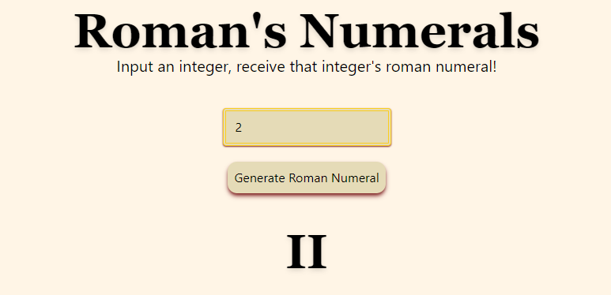

# Roman's Numerals

## Description
Going to ancient Rome, but unsure how to use Roman Numerals? Never fear, [this translator](https://sarahwylie.github.io/RomansNumerals/) will allow make the simple adjustment from Western Arabic Numbers to Roman Numerals for you! Now you can focus your energy on applying more oil to your body for wrestling matches in The Colosseum.

## Built With
*HTML *Tailwind *Javascript

## Table of Contents
* [Output](#output)
* [Tests](#tests)
* [Badges](#badges)
* [Queries](#any-questions)

## Output:

## Tests
No tests were used to create this project.

### Badges

### Any Questions?
Contact [@sarahwylie](https://github.com/sarahwylie) on GitHub

© 2023 by Sarah Wylie